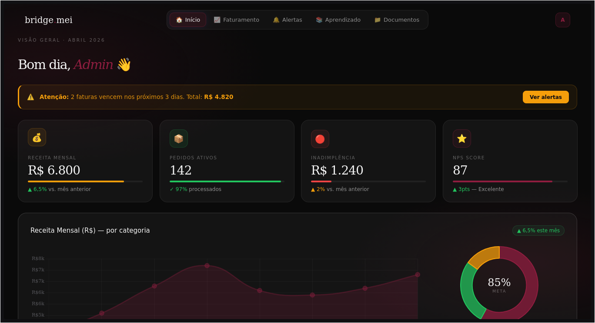
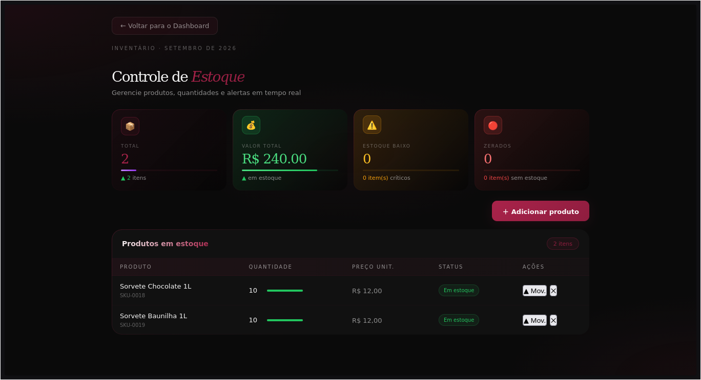

# BridgeMEI | Gestao Financeira
_Desenvolvido por: Enzo e Marcus_

*O BridgeMEI ainda não foi publicado, mas continuaremos com o projeto aqui no github mesmo após o lançamento.*

##  Sumário
  - [Sobre](#sobre)
  - [O que vem nele?](#o-que-vem-nele)
  - [Demonstracoes](#demonstracoes)
  - [Tecnologias utilizadas](#tecnologias-utilizadas)
  - [Como testar](#como-testar)
  - [Etapas de Desenvolvimento](#etapas)

## Sobre
BridgeMEI é um MVP(produto mínimo viável) de gestão financeira, o qual tem diversas funcionalidades. Por exemplo: você pode olhar o faturamento do seu negócio de forma dinâmica, fazer o controle do seu estoque e muito mais.
## Demonstracoes




## O que vem nele?
O BridgeMEI possui alguns recursos para facilitar a vida de um MEI, como:
- Dashboard
- Faturamento
- Guia de Aprendizado
- Controle de Estoque

## Tecnologias utilizadas
* Front-end em React (JS)
* Back-end em C# (ASP.NET Core)
* Banco de Dados em SQL
* Autenticação em JWT
## Como testar
Para testar o projeto, você precisa verificar primeiro se as dependências
abaixo estão instaladas no seu computador:
- .NET (versão 10.0)
- Node.js (24.15 LTS)
- MySQL 8.0.46

Usando os seguintes comandos no PowerShell ou no seu terminal:
``` 
dotnet --list-sdks (.NET)
node -v npm -v (Node.js)
mysql --version 
```

Após isso, siga as instruções:

## Etapas
Projeto Inteiro:
* ~~Criacao do BridgeMEI~~
* ~~Criacao da tela Mei~~
* ~~Criacao da API Login~~
* ~~Criacao da tela Estoque~~
* ~~Criacao da API Estoque~~
* ~~Tabela do estoque relacional~~
* **Adicao de temas novos**
* Importacao de arquivos (Excel e .csv)
* [...]
* Publicacao App BridgeMEI

Branch style:
* ~~Mudanca das cores do site~~
* ~~Centralizacao do tema do site~~
* Aplicacao de UI/UX eficiente
* Criacao de tema claro

_O BridgeMEI é um projeto escolar, feito por estudantes da Etec-SP_