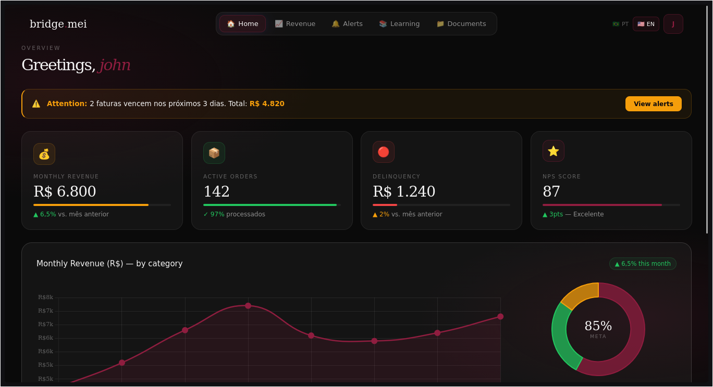
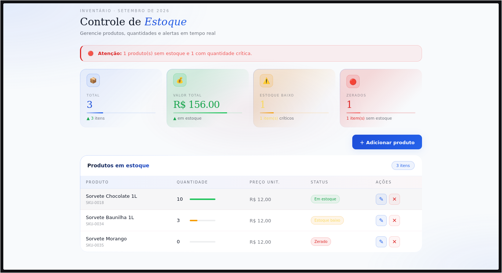

# BridgeMEI | Gestão Financeira
_Desenvolvido por: Enzo e Marcus_

*O BridgeMEI ainda não foi publicado, mas continuaremos com o projeto aqui no github mesmo após o lançamento.*

##  Sumário
  - [Sobre](#sobre)
  - [O que vem nele?](#o-que-vem-nele)
  - [Novidades](#novidades)
  - [Tecnologias utilizadas](#tecnologias-utilizadas)
  - [Como testar](#como-testar)
  - [Etapas de Desenvolvimento](#etapas)

## Sobre
BridgeMEI é um MVP(produto mínimo viável) de gestão financeira, o qual tem diversas funcionalidades. Por exemplo: você pode olhar o faturamento do seu negócio de forma dinâmica, fazer o controle do seu estoque e muito mais.

## Novidades
O BridgeMEI agora vem com três adições: 
- Identidade Visual nova;
- Tema novo;
- Tradução para o inglês  

Tema Escuro:  


Tema Claro:  


## O que vem nele?
O BridgeMEI possui alguns recursos para facilitar a vida de um MEI, como:
- Dashboard
- Aba de Faturamento
- Guia de Aprendizado
- Controle de Estoque

## Tecnologias utilizadas
* Front-end em React.js
* Back-end em C# (ASP.NET Core)
* Banco de Dados em MySQL
* Autenticação em JWT
## Como testar
Para testar o projeto, você precisa verificar primeiro se as dependências
abaixo estão instaladas no seu computador:
- .NET (versão 10.0)
- Node.js (24.15 LTS)
- MySQL 8.0.46

Usando os seguintes comandos no PowerShell ou no seu terminal:
``` 
dotnet --list-sdks (.NET)
node -v npm -v (Node.js)
mysql --version 
```

Instruções para rodar:
1. Abra um terminal na pasta do projeto e digite ` npm install ` para os pacotes do ` .jsx `  
2. Depois, rode ` npm run dev ` para carregar o visual do site  
3. Abra um novo terminal dentro de ` pasta-api ` e rode:
```
dotnet restore
dotnet run
```  
4. Abra um outro terminal dentro de ` EstoqueApi ` e rode os mesmos comandos do passo 3  
5. Faça o primeiro cadastro e depois faça o Login para entrar no site.  
_Importante: A API de Login funciona com banco em memória, isso significa que você tem que fazer o cadastro toda vez que ligar a API_

## Etapas
Projeto Inteiro:
* ~~Criação do BridgeMEI~~
* ~~Criação da tela Mei~~
* ~~Criação da API Login~~
* ~~Criação da tela Estoque~~
* ~~Criação da API Estoque~~
* ~~Tabela do estoque relacional~~
* ~~Adição de temas novos~~
* **Importação de arquivos (Excel e .csv)**
* [...]
* Publicacao App BridgeMEI

Branch: [...]

_O BridgeMEI é um projeto escolar, feito por estudantes da Etec-SP_
